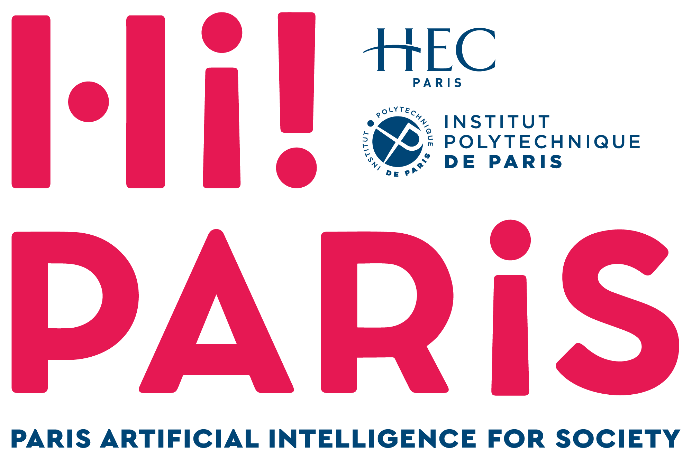
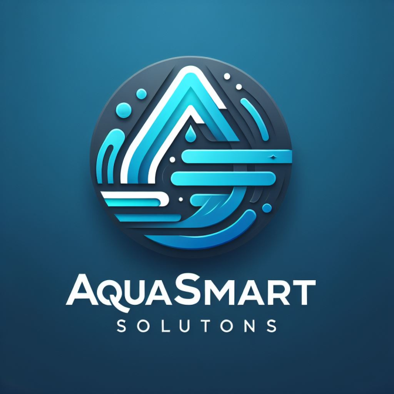

# Hi!ckathon #5: [Group 21] AI & Sustainability 🌲

## About the Hi! PARIS Hi!ckathon

The Hi!ckathon is a competitive AI and Data Science challenge organized by Hi! PARIS, the Center dedicated to data science and AI created by HEC Paris and Institut Polytechnique de Paris and joined by Inria in 2021.

The AI competition is open to students from Institut Polytechnique de Paris, HEC Paris as well as other french and international universities.

The H!ckathon #5 is split into a 3 week preparation pre-Hi!ckathon phase (courses + Career Fair) and a final sprint, taking place November 29th to December 2nd 2024.

**Visit the Hi!ckathon website:** https://www.hi-paris.fr/hickathon/


<!-- [](https://www.hi-paris.fr/hickathon/) -->


## Pre-hickathon Data Science courses

The pre-h!ckathon phase includes four Data Science courses on Feature Engineering, Machine Learning, Deep Learning & Explainability created by the Hi! PARIS Engineering Team.

Three technical courses can be found in the courses/ folder of [**Hi!ckathon #5 GitHub Repository**](https://github.com/hi-paris/Hickathon5/tree/main)

How do I download notebooks ?

- You can download the notebooks directly on github
- You can clone the repository locally to load all files directly.

```bash
# Clone the github repository 
git clone https://github.com/bryanbradfo/Hickathon5.git

# Create a virtual environment for the repository
python3 -m venv venv_hi5
venv_hi5/Scripts/activate # Windows
source venv_hi5/bin/activate # Linux

# Install package dependencies
pip install -r requirements.txt
```

## Notebooks on Google colab

You can also open the notebooks via Google colab:

- **Feature Engineering:** https://drive.google.com/file/d/1vN8_pFNoTmeSfH9F9irl9fwbsj6lCsJv/view?usp=sharing
- **Explainability:** https://drive.google.com/file/d/1nPv-5InyQ6XqoIsrOq5iwxYhNC4XJtvM/view?usp=sharing
- **Deep Learning:** https://colab.research.google.com/drive/1ZPl35J9lE-2jB6PPe5cR21SX-ljbJNST?usp=sharing

# Aqua Smart Solution 🫗❌: Predicting freshwater availability 

<!--  -->

**Buiness Presentation:** [video link](https://drive.google.com/file/d/1ZsgbfyUFnrIRktJqUcCCRhGZLdSBVJbH/view?usp=sharing)



## Overview 🏞️
Water is Earth’s most valuable resource, essential for drinking, power generation, and agriculture. Despite its abundance, freshwater is limited, with desalination often being too costly. Natural sources like groundwater play a critical role but face seasonal shortages, particularly in summer. Droughts and water restrictions cost industries—especially agriculture—billions annually.

Our mission: **leverage machine learning to predict droughts** and optimize water usage, reducing costs for farmers and improving resource allocation for utilities providers. 

## Business Impact
- **Agricultural industry**: Saves millions by adjusting crop sizes to match water availability.
- **Water utilities**: Efficient resource allocation minimizes costly water transport.
- **French water market**: A €85.1 billion market stands to benefit from optimized supply chains.

## Scientific Approach
- **Data preprocessing**: Handled NaNs with estimations, medians, and weather correlations.
- **Feature engineering**: Separated numerical and categorical data for tailored processing.
- **Model**: Random Forest Classifier, robust against overfitting, well-suited for classification, and explainable.
- **Sustainability**: Operates on green energy and recycled servers to minimize resource waste.

## Results and scalability
- **Accuracy**: 54% with limited initial data, showing significant promise for improvement.
- **Efficiency**: Relies on data from the past 2-3 summers, ensuring scalability and fast processing.
- **Future plans**: Expand dataset, refine precision, and integrate market insights for optimal water trading.


## Hi!ckathon #5 Repository

Check out the repository to explore the Hi!ckathon work and dive deeper into this event situations:  
[**Hi!ckathon #5 GitHub Repository**](https://github.com/hi-paris/Hickathon5/tree/main)


## Join Us
Let’s build a future where technology enables sustainable and efficient water management. Reach out to us to collaborate or learn more about AquaSolution Strategy!
